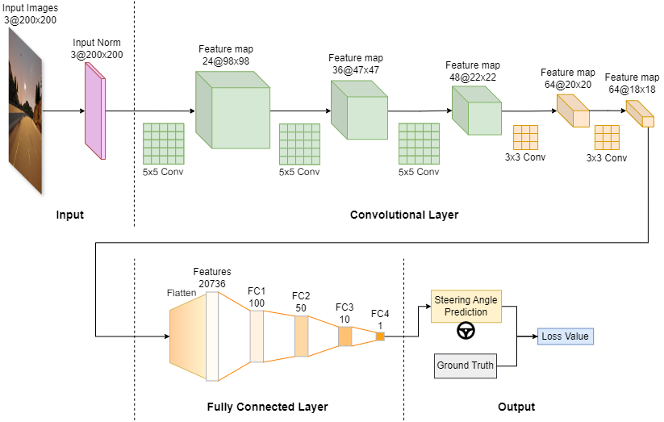
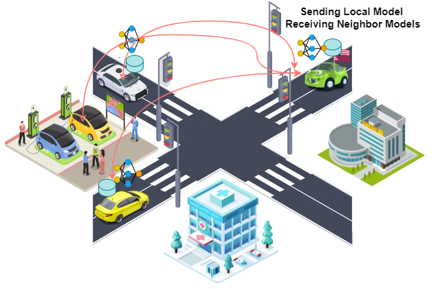
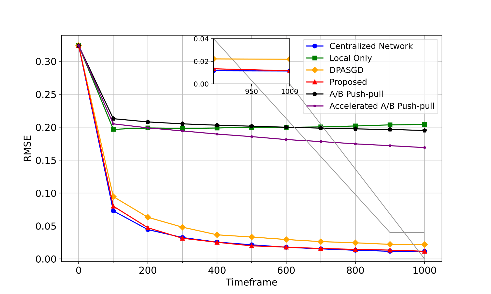

# Deep Federated Learning for Autonomous Driving

*Achieving human-level autonomous driving while preserving the privacy of autonomous vehicle (AV) owners remains a challenge due to the limited data availability and the inherent mobility of vehicles. This work introduces a decentralized federated learning (DFL) framework for end-to-end autonomous driving. In this framework, we consider AVs as autonomous agents in the multi-agent system, communicating over time-varying vehicle-to-vehicle (V2V) networks, collaboratively training CNN-based deep learning (DL) models. To facilitate global consensus among AVs, we propose a novel consensus-based algorithm called FedTV, which uses decentralized stochastic gradient tracking and a push-pull algorithm to function over time-varying directed V2V networks. Experimental results across three datasets (Udacity, Carla, Gazebo) demonstrate that the proposed framework achieves state-of-the-art performance, outperforming baseline algorithms in various settings.*


*<center>**Figure 1**: DFL for Autonomous Driving over Time-varying Directed Communication Networks.</center>*


*<center>**Figure 2**: Neural network architecture.</center>*

This is the first work considering DFL for Autonomous Driving over Time-varying Directed Communication Networks. We benchmark our method on three public datasets: [Udacity](https://www.udacity.com/self-driving-car), Carla, and Gazebo.

This repository is inspired by @Othmane Marfoq https://arxiv.org/abs/2010.12229

## Summary

* [Prerequisites](#prerequisites)
* [Federated Learning for Autonomous Driving](#federated-learning-for-autonomous-driving)
* [Training](#training)
* [Result](#result)

### Prerequisites

PYTHON 3.7

CUDA 9.2

Please install dependence package by run following command:
```
pip install -r requirements.txt
```

### Federated Learning for Autonomous Driving

Important: Before running any command lines in this section, please run following command to access 'graph_utils' folder:
```
cd graph_utils
```
And now, you are in 'graph_utils' folder.

Please download graph data at [link](https://github.com/omarfoq/communication-in-cross-silo-fl/tree/main/graph_utils/data) and put into `data` folder.

* To generate networks for GAZEBO dataset and compute the cycle time for them:
    ```
    bash generate_network_driving-gazebo.sh
    ```

* To generate networks for CARLA dataset and compute the cycle time for them:
    ```
    bash generate_network_driving-carla.sh
    ```

### Training

* To train our method on GAZEBO dataset with GAIA network, run:

```
bash train_gazebo_gaia.sh
```

* To train our method on CARLA dataset with GAIA network, you can use the same setup on GAZEBO.

### Result

*<center>**Figure 3**: Initial results.</center>*

* The result demonstrates that our proposed method outperformed the existing methods